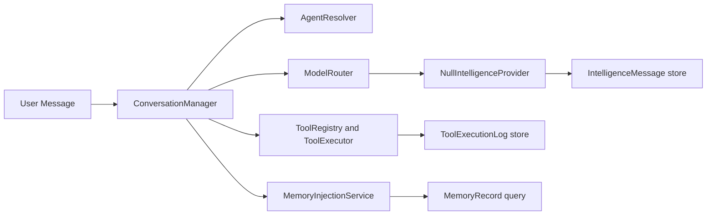

# Phase 3 Intelligence Engine Report

## What Was Built

Phase 3 adds a new `app/Domains/Intelligence` bounded slice to the POA ERP. The implementation includes:

- agent runtime entities, policies, requests, services, and admin pages
- prompt registry storage, rendering, activation, and admin pages
- enterprise memory records with retrieval, review, and selective injection services
- tool registry, safe stub handlers, approval checks, execution logging, and admin pages
- model routing rules with fallback-aware resolution
- conversation orchestration with provider-neutral stub execution
- streaming-ready DTO and null streaming contract
- intelligence workspace routes, navigation, and diagnostics UI

## Architecture Diagram

## New Database Tables

- `agents`
- `prompt_templates`
- `memory_records`
- `ai_tools`
- `model_routing_rules`
- `intelligence_conversations`
- `intelligence_messages`
- `tool_execution_logs`

## Services And Classes Added

- `AgentManager`, `AgentResolver`, `AgentExecutionService`, `ConversationManager`
- `PromptTemplateRepository`, `PromptTemplateRenderer`, `PromptVersioningService`
- `MemoryExtractor`, `MemoryRepository`, `MemoryRetriever`, `MemoryInjectionService`, `MemoryReviewService`
- `ToolRegistry`, `ToolExecutor`, `ToolApprovalService`
- `ModelRouter`
- `NullIntelligenceProvider`, `NullStreamingProvider`
- DTOs: `AgentExecutionResponse`, `ToolExecutionResult`, `StreamChunk`
- handlers: `CurrentDatetimeToolHandler`, `CalculatorToolHandler`, `PlatformStatusToolHandler`, `ConversationSummaryToolHandler`, `DocumentLookupStubToolHandler`, `ErpLookupStubToolHandler`

## Admin Routes Added

- `/intelligence`
- `/intelligence/agents`
- `/intelligence/prompts`
- `/intelligence/memory`
- `/intelligence/tools`
- `/intelligence/tool-logs`
- `/intelligence/model-routing`
- `/intelligence/conversations`

## How Agent Execution Works

1. `ConversationManager` resolves or creates a conversation.
2. `AgentResolver` selects the active agent.
3. user and assistant messages are persisted in `intelligence_messages`.
4. `MemoryInjectionService` selectively retrieves memory by subject, confidence, visibility, and expiry.
5. `ModelRouter` resolves the provider/model pair with fallback metadata.
6. `ToolRegistry` and `ToolExecutor` run safe active tools allowed by the agent.
7. `NullIntelligenceProvider` returns a provider-neutral stub response and usage payload.
8. `ToolExecutionLog` and `IntelligenceConversation` are updated for auditability.

## How Memory Is Controlled

- memory injection is disabled when the agent has `memory_enabled = false`
- retrieval filters by subject, visibility tier, minimum confidence, and expiry
- memory review is explicit through `MemoryReviewService`
- the Phase 3 UI exposes a review action rather than automatic trust promotion

## How Tools Are Approved And Executed

- tools are registered in `ai_tools`
- approval defaults to safe auto-approval for seeded stub tools
- execution flows through `ToolExecutor`
- every execution attempt writes a `tool_execution_logs` record with status, approval, payload, duration, and error context
- no destructive tools were added in this phase

## How Model Routing Works

- `ModelRoutingRule` stores provider, model, capability, priority, token envelope, and fallback details
- `ModelRouter` selects the first enabled rule ordered by priority
- if no rule matches, config fallback is used from `config/intelligence.php`

## What Remains Stubbed

- real provider integrations and external API calls
- full document and ERP lookup implementations
- frontend streaming transport
- advanced prompt schema validation beyond variable key presence
- automatic memory extraction pipelines from every conversation

## Phase 4 Recommendations

- add provider adapters for OpenAI-compatible, Ollama, and local inference backends
- wire document library and ERP read paths into the stub lookup tools with permission-aware filters
- add streaming transport, chunk persistence, and frontend incremental rendering
- expand diagnostics to include routing explanation traces and memory retrieval previews
- add deeper approval workflows for tools that cross sensitive organizational boundaries
